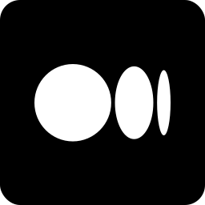
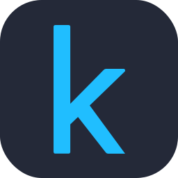
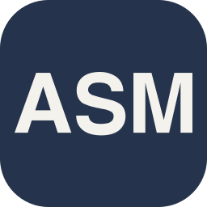
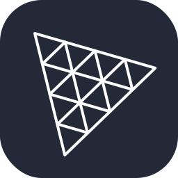
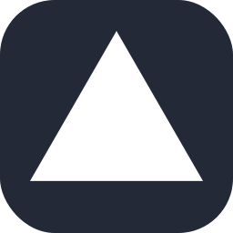
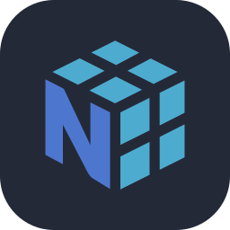
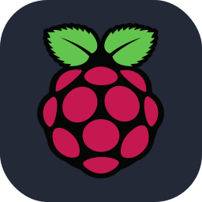
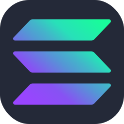

<h2>summary</h2>

**`web developer/data scientist`**

i'm a data science student with a strong interest in deep learning, and a bit of competitive programming and web development. i love building things from scratch and often find myself reading research papers just to satisfy my curiosity.
 

<h3>you can also find me on:</h3>

 

<!--

<h2>languages and tools</h2>

<h3>programming languages:</h3>

<h3>web development:</h3>

<h3>databases & clouds:</h3>

<h3>machine learning & data science:</h3>

<h3>tools & other:</h3>

-->

<h2>github statistics</h2>

&nbsp;

 

<b>note:</b> top languages is only a metric of the languages my public code consists of and doesn't reflect experience or skill level.

