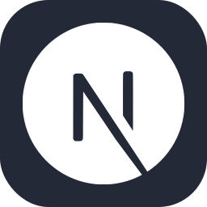
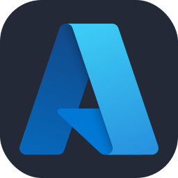
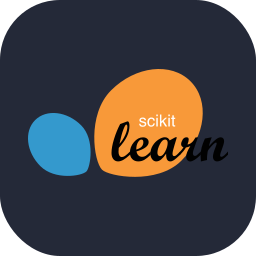
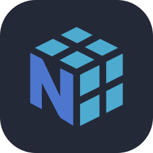
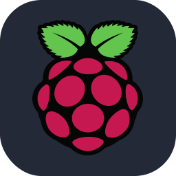
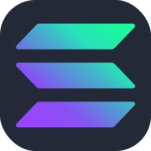

<h2>Summary</h2>

**`Web Developer/ML Engineer`**

I'm a generalist with a strong interest in web development and machine learning/deep learning, with a focus on building scalable and intelligent systems. All coding projects are built from the ground up, from planning and designing all the way to solving real-life problems with code.  Let's connect and build something awesome together – or at least something that doesn't crash.
 

<h3>You can also find me on:</h3>

 

<h2>Languages and Tools</h2>

<h3>Programming Languages:</h3>

<h3>Web Development:</h3>

<h3>Databases & Clouds:</h3>

<h3>Machine Learning & Data Science:</h3>

<h3>Tools & Other:</h3>

<!-- Tools & Other -->

